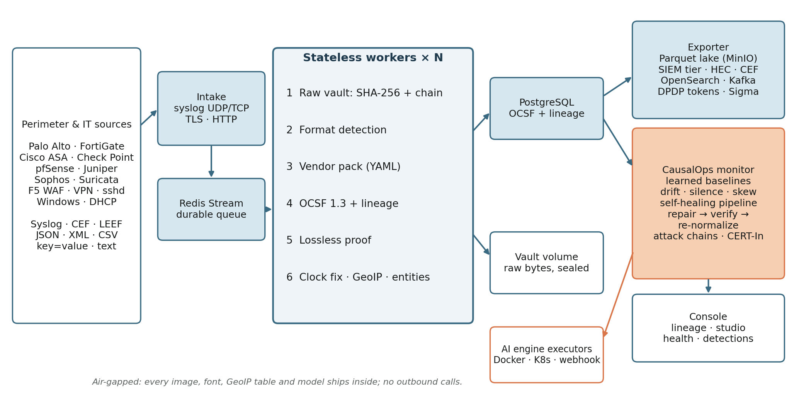

# CausalOps ULPF: a self-healing Universal Log Pre-processing Framework

**SIH 2026 · Problem Statement 26156 (NTRO) · Blockchain & Cybersecurity**

CausalOps ULPF ingests logs from any device in any format and keeps every raw byte in a hash-chained, write-once vault. It normalizes events to **OCSF 1.3** and proves, for every event, that the normalized record still contains the whole original. It then does what log pipelines usually don't: the **CausalOps engine watches the pipeline itself**. It detects when a vendor's format change silently breaks parsing, when a source goes quiet, when a device clock drifts, or when a worker crashes. It repairs each through a verified, reversible, audited policy, and re-normalizes the affected history.



## Run it (one command)

**Requirements:** Docker Desktop with 4+ CPUs and 8+ GB RAM, on macOS, Linux or Windows.

```bash
bash scripts/demo/start.sh
```

Then open **http://localhost:3000** and go to **Log pipeline**.

The repository ships a demo snapshot, so a fresh clone starts with learned baselines, bound vendor packs and live demo traffic from 12 vendors.

| URL / port | What |
|---|---|
| http://localhost:3000 | Console (Log pipeline + AIOps) |
| `udp/tcp 5514`, `tcp 6514` (TLS) | Syslog intake |
| `POST /api/ulpf/ingest` | HTTP intake (header `X-Source`) |
| http://localhost:8080/api | Platform API |
| http://localhost:9001 | MinIO console (data lake) |
| http://localhost:3001 | Grafana |

**Send your own log:**
```bash
echo '<14>Oct  3 10:00:00 myfw CEF:0|Acme|FW|1|100|blocked|7|src=10.0.0.1 dst=8.8.8.8 act=deny' | nc -u -w1 localhost 5514
```

## Images: Docker Hub or fully offline

- **From Docker Hub (no local build):**
  ```bash
  DOCKERHUB_NAMESPACE=<namespace> docker compose pull
  ```
  ```bash
  DOCKERHUB_NAMESPACE=<namespace> docker compose up -d --no-build
  ```
- **Build and tag for publishing:**
  ```bash
  DOCKERHUB_NAMESPACE=<you> CAUSALOPS_VERSION=1.0.0 bash scripts/release/build_and_tag.sh
  ```
  Add `--push` to publish.
- **Air-gapped install (requirement j):**
  1. On a connected machine:
     ```bash
     bash scripts/release/export_offline.sh
     ```
     This writes `dist/causalops-images-<version>.tar.gz` (every image, with a SHA-256 checksum).
  2. Copy the repository and the archive into the isolated network.
  3. There:
     ```bash
     bash scripts/release/load_offline.sh dist/causalops-images-<version>.tar.gz
     ```
     No registry is contacted. Fonts, the GeoIP table (DB-IP Lite, CC BY 4.0) and models are inside the images.

## PS 26156 requirements

| Req | How it is met | Where to see it |
|---|---|---|
| **a** Preserve raw data | Write-once vault with SHA-256 per event and hash chain per segment (retention-safe anchors). A lossless proof per event: the raw log is rebuilt from the normalized record and its hash compared with the vault's. | Event explorer → *Verify lossless*; Log sources → *Verify whole vault* |
| **b** Parse source attributes | Exact-span parsers for Syslog RFC 3164/5424 (with structured data), CEF, LEEF 1/2, JSON, XML, CSV, key=value, Cisco ASA, free text. 13 YAML vendor packs. | Parser packs |
| **c** Common taxonomy | OCSF 1.3 classes 2004, 3002, 4001, 4002, 4003 and 4004. Vendor fields are kept in `unmapped`. | Event explorer |
| **d** Traceability | Every record carries its uid, raw SHA-256, vault segment and offset, chain hash and pack version, with click-through lineage. | Event lineage view |
| **e** Plug-and-play onboarding | **Parser Studio:** samples, then a Drain3 / auto-map proposal, then a test against the current pack, then activation (live in 10 s, no restart). | Parser studio |
| **f** Unified visibility | Sources, events, cross-vendor entity graph, pipeline health, detections. | Log pipeline section |
| **g** SIEM / data lake | Parquet lake on MinIO (S3) and a SIEM tier; Splunk HEC, CEF syslog, OpenSearch and Kafka sinks. | Outputs & cost |
| **h** AI/ML ready | OCSF Parquet features; the CausalOps anomaly gate and correlation; Sigma rules on OCSF. | Pipeline health, Detections |
| **i** Less parser effort | YAML instead of code, automatic proposals, automatic repair after format changes. | Parser studio, Pipeline health |
| **j** Air-gapped | Offline image archive; no outbound calls; bundled fonts and GeoIP. | `scripts/release/` |
| **k** Containers | One `docker compose`; Docker Hub images. | `docker-compose.yml` |

## Twelve differentiators

1. **Parser drift detection with safe repair.** Learned fill-rate baselines detect a vendor's format change. A repaired pack is inferred, shadow-tested against the current pack, promoted under 9 policy rules, verified on live data or rolled back.
2. **Provable losslessness.** For every event, the raw log rebuilt from OCSF alone has the same SHA-256 as the vault copy.
3. **Silent-source detection.** A Poisson test on each source's learned rate. A firewall that stops logging is a security signal.
4. **Self-healing pipeline.** Crashed workers are detected and started through the CausalOps Docker executor, then verified with zero loss (received = stored + in flight).
5. **Historical re-normalization.** Fixes the past from the vault and keeps every previous revision ("as parsed by v1 vs v2").
6. **CERT-In 2022 compliance.** Retention, jurisdiction, NTP sync, reporting sources, integrity and the 6-hour evidence pack, all checked from measurements.
7. **Clock-skew correction.** Per-source offset estimation and correction; the device's own time is kept.
8. **SIEM cost tiering.** Slim OCSF records and summaries of routine flows, with pointers to the lake. Volume is measured and nothing is dropped.
9. **DPDP privacy.** Format-preserving tokens for users, IPs, e-mails, mobile and Aadhaar numbers; detokenizing is audited.
10. **Sigma on OCSF.** One rule fires across every vendor.
11. **Entity graph and attack chains.** IP, host, MAC and user resolved across vendors; scan → brute force → login correlated into one incident.
12. **Signed bundles.** Ed25519-signed exports for data diodes and evidence; a single changed byte is rejected.

## Verify every claim

```bash
python3 scripts/dev/verify_ulpf.py --quick
```
```bash
python3 scripts/dev/verify_ulpf.py
```

The quick run takes about 30 s and runs no fault scenarios. The full run takes about 15 min and injects every scenario. Unit and golden tests:

```bash
python3 -m pytest tests/ulpf -q
```

Throughput through the live intake:

```bash
python3 scripts/ulpf/bench.py --seconds 30
```

**Docs:**
- Architecture document (2 pages): [docs/sih/CausalOps_ULPF_Architecture.pdf](docs/sih/CausalOps_ULPF_Architecture.pdf)
- Technical deck (5 slides): [docs/sih/CausalOps_ULPF_SIH26156.pptx](docs/sih/CausalOps_ULPF_SIH26156.pptx)
- Demo video script: [docs/sih/DEMO_SCRIPT.md](docs/sih/DEMO_SCRIPT.md)
- Phase reports: `docs/phases/ULPF_U1..U5_REPORT.md`

The documents are rebuilt from live measurements with `python3 docs/sih/build.py`.

## Repository layout

| Path | What |
|---|---|
| `ml/ulpf/` | ULPF: intake, workers, vault, parsers, packs, OCSF, lossless proof, studio, quality monitor, repair, re-normalization, exporter, sinks, tiering, privacy, Sigma, bundles, compliance, correlation, replayer, benchmark |
| `ml/ulpf/packs/`, `ml/ulpf/sigma/` | Vendor packs (YAML) and Sigma rules |
| `ml/engine/` | CausalOps engine: baselines, anomaly gate, lagged causal model, RCA, counterfactual, calibration, executors (Docker, Kubernetes, webhook) |
| `backend/causalops-api` | Spring Boot platform API, Flyway migrations V1–V12, proxy `/api/ulpf/**` |
| `src/` | React console |
| `infrastructure/` | ULPF image, console nginx, OTel collector, Prometheus, Loki, Tempo, Grafana, Postgres init |
| `services/` | Instrumented reference microservices (AIOps demo) |
| `scripts/demo`, `scripts/release`, `scripts/dev`, `scripts/ulpf` | Start/reset, release and offline images, end-to-end checks, benchmark |

## CausalOps AIOps (the engine behind it)

The same platform also runs root-cause analysis and tiered auto-remediation on an instrumented microservice system. It does this through OpenTelemetry, a self-calibrating causal model, counterfactual simulation and verified remediation; see **Command → Overview** in the console and `docs/MAC_SETUP_AND_DEMO.md`.

## Security notes

- Set real secrets in `.env` (see `.env.example`) for anything beyond a local demo: `ENGINE_INTERNAL_TOKEN`, `ULPF_PRIVACY_KEY`, `MINIO_ROOT_PASSWORD`, `CHAOS_TOKEN`.
- The TLS intake certificate is generated on first start; replace it with your PKI's.
- The bundle signing key lives in the ULPF volume. Put other sites' public keys in `keys/trusted/` to accept their bundles.

## Team

PBL Semester V, T.E. AI & DS (Division A), Thakur College of Engineering and Technology:
- Vedant Bist (14)
- Aayush Gupta (35)
- Mayank Jaiswal (54)

Guide: Ms. Swati Mude, Assistant Professor.
