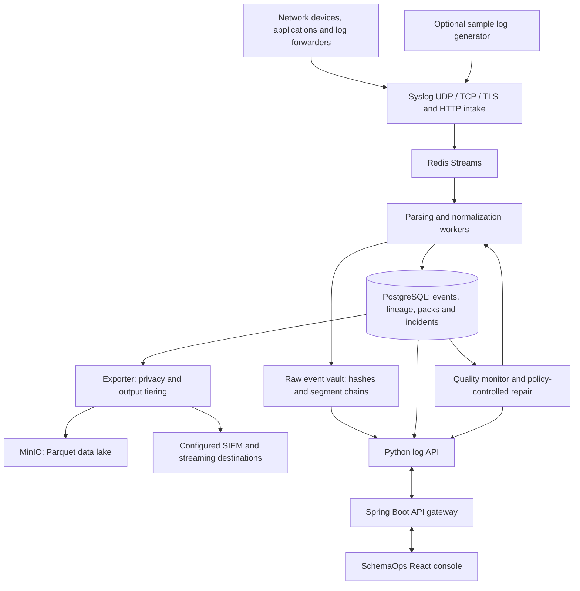

# SchemaOps

**Universal Log Pre-processing Framework**

SchemaOps collects heterogeneous device and application logs, preserves their original data, and transforms supported events into a common OCSF representation. It combines source onboarding, parser management, event lineage, pipeline monitoring, and downstream exports in one console.

The framework separates raw evidence from normalized analytics. Source-specific fields remain available even when they do not have a standard mapping, and supported lossless reconstruction can be checked against the original event's SHA-256 hash.

## Architecture



### Event processing flow

1. **Receive:** collect logs over Syslog or HTTP and queue them in Redis Streams.
2. **Preserve:** workers append original events to the raw vault, recording hashes and segment-chain information.
3. **Parse:** detect supported formats and extract source-specific attributes using parsers and versioned YAML packs.
4. **Normalize:** map fields into OCSF 1.3 classes, retaining additional attributes under `unmapped` and reconstruction metadata.
5. **Store and acknowledge:** persist events and lineage in PostgreSQL before acknowledging queue entries. Idempotent writes and pending-message recovery support worker retries.
6. **Monitor:** measure parsing quality, source activity, clock skew, and worker health. Supported repairs pass through policy checks and verification.
7. **Use and export:** investigate events, correlate entities, evaluate detections, or export to the data lake and configured destinations.

The vault provides tamper-evident records; it is not a substitute for externally enforced immutable storage. Queue durability, backups, retention, and storage capacity must be configured for the deployment.

### Main components

| Component | Responsibility |
| --- | --- |
| React / Vite console | SchemaOps pages, investigation, and parser workflows |
| Spring Boot API | Platform API and `/api/ulpf/**` proxy |
| Python / FastAPI service | Intake, log APIs, onboarding, and verification |
| Normalization workers | Parsing, vault writes, OCSF conversion, and event persistence |
| Redis | Stream-based ingestion queue |
| PostgreSQL | Normalized events, source metadata, parser versions, and audit state |
| Monitor | Pipeline health, incident correlation, and verified repair workflows |
| Exporter and MinIO | Output tiering and Parquet data lake |
| Sample replayer | Generated multi-source traffic for local exploration |

The repository also contains the original CausalOps engine, reference microservices, and observability stack. These support the shared platform, while the default console presents SchemaOps. Internal service names, environment variables, API paths, and archive names retain `causalops` or `ulpf` for compatibility.

## Capabilities

- **Multiple input formats:** Syslog RFC 3164/5424, JSON, XML, CSV, CEF, LEEF, key-value logs, Cisco ASA messages, and free-text handling.
- **Vendor packs:** bundled definitions for Palo Alto, Fortinet, Cisco ASA, Check Point, pfSense, Juniper, Sophos, Suricata, OpenSSH, Windows Security, and DHCP, plus generic CEF and LEEF packs.
- **Common event taxonomy:** supported OCSF classes for authentication, network, HTTP, DNS, DHCP, and detection events.
- **Traceability:** event IDs link normalized records to source data, vault locations, hashes, and parser versions.
- **Parser Studio:** load or paste samples, analyze them, review a proposed YAML pack, test it, and activate it without restarting the stack.
- **Pipeline quality monitoring:** learned source baselines, parser drift, source silence, clock skew, worker health, and audited repair history.
- **Historical re-normalization:** process stored raw events with updated mappings while retaining revision history.
- **Analytics:** cross-source entity relationships, supported Sigma-style rules, and correlated incident evidence.
- **Outputs:** Parquet in MinIO, compact SIEM representations, and adapters for Splunk HEC, CEF syslog, Kafka, and OpenSearch.
- **Privacy and evidence:** export pseudonymization, audited token reveals, signed evidence bundles, and operational compliance checks.

Unknown sources can be preserved before a suitable parser is configured. Automatic proposals still require review: retaining a field in `unmapped` preserves information but does not give it a standardized meaning. External sinks require configuration, and measured throughput depends on the deployment; containerization alone does not establish production-scale capacity.

## Setup

### Prerequisites

- Git and Docker Compose v2.
- Docker Desktop using Linux containers on Windows/macOS, or Docker Engine on Linux.
- Start with at least 4 CPU cores and 8 GB RAM available to Docker. The full stack benefits from 12–16 GB RAM and sufficient disk space for images, raw logs, and database volumes.
- Bash for the helper scripts; on Windows, use Git Bash or WSL. The basic Compose commands also work directly in PowerShell.

Host installations of Java, Python, and Node.js are not required for the container setup.

### 1. Prepare configuration

Open a terminal in the repository root and create `.env` if it does not already exist.

**PowerShell:**

```powershell
if (!(Test-Path .env)) { Copy-Item .env.example .env }
```

**Bash:**

```bash
[ -f .env ] || cp .env.example .env
```

Review these settings before starting:

| Setting | Purpose |
| --- | --- |
| `POSTGRES_PASSWORD` | Database credentials |
| `ENGINE_INTERNAL_TOKEN` | Internal engine authentication |
| `ULPF_PRIVACY_KEY` | Stable key for privacy token generation |
| `MINIO_ROOT_USER`, `MINIO_ROOT_PASSWORD` | Data lake credentials |
| `DOCKERHUB_NAMESPACE`, `CAUSALOPS_VERSION` | Image namespace and release tag |
| `ULPF_REPLAY_RATE` | Generated sample traffic rate; the default is approximately 40 events/second |

Keep keys and credentials private. Preserve the privacy key across restarts if tokens must remain consistent. Changing the database password in `.env` does not update credentials inside an already initialized database volume.

### 2. Build and start

```bash
docker compose up -d --build
```

The first build downloads dependencies and may take several minutes. Use the main [docker-compose.yml](docker-compose.yml) for the complete SchemaOps stack; the separate production Compose file is not an equivalent log-pipeline deployment.

Alternatively, the Bash startup helper builds and starts the stack, waits for the platform API, and configures an application warm-up window:

```bash
bash scripts/demo/start.sh
```

For subsequent starts without rebuilding:

```bash
docker compose up -d
```

### 3. Check availability

```bash
docker compose ps
```

On Windows PowerShell:

```powershell
curl.exe --max-time 15 http://localhost:8080/actuator/health
curl.exe --max-time 15 http://localhost:3000/api/ulpf/stats
```

On Linux/macOS, use `curl` in place of `curl.exe`. A running container may still be initializing; use the health responses and logs to confirm readiness.

### 4. Open the console

Open **http://localhost:3000**.

| Address / port | Service |
| --- | --- |
| `http://localhost:3000` | SchemaOps console |
| `http://localhost:8080` | Platform API |
| `http://localhost:8090` | Direct log-processing API |
| UDP / TCP `5514` | Syslog intake |
| TCP `6514` | Syslog over TLS |
| `http://localhost:9000` | MinIO S3 API |
| `http://localhost:9001` | MinIO console |
| `http://localhost:3001` | Grafana |

These are default host ports. Check `.env` and Compose port mappings if a port is already in use.

## Understanding the console

| Page | What it represents | First operation to try |
| --- | --- | --- |
| **Log sources** | Discovered sources, formats, assigned packs, event counts, quality, and raw-vault integrity | Open a source's events and inspect its format and pack |
| **Pipeline health** | Source and worker problems, correlated incidents, decisions, and verification timelines | Open an incident and read its evidence and policy results |
| **Event explorer** | Searchable normalized events | Open an event to compare raw data, OCSF fields, and lineage; run **Verify lossless** |
| **Entities** | IP, user, hostname, and MAC relationships across sources | Select an entity and inspect the source events behind its connections |
| **Detections** | Supported rules and their matches against normalized events | Follow an evidence link to the underlying event |
| **Parser studio** | Sample analysis, YAML mapping proposals, tests, and activation | Load samples, analyze, review the pack, and test before activating |
| **Parser packs** | Pack versions, active champions, retired versions, and source bindings | Inspect a pack's YAML and mapped fields |
| **Outputs & cost** | Output volumes, tiering, and export destinations | Compare stored and exported representations |
| **Privacy** | Stored versus pseudonymized exports and token-reveal audit history | Select an event and compare the two representations |
| **Compliance** | Retention, integrity, time, and evidence-related operational checks | Inspect a check's evidence and available bundle workflow |
| **Benchmarks** | Performance measurements and test results | Read the test scope and workload before interpreting a result |

An incident marked **Escalated** requires investigation. An action marked **Blocked** means the proposed action was prevented by policy; it does not mean the source IP has been blocked on a firewall. Network enforcement requires an explicitly configured external integration. Compliance checks provide evidence about configured controls, not an automatic compliance certification.

### Where the initial logs come from

The default stack includes `log-replayer`, which generates sample firewall, VPN, authentication, and other device-style events. Familiar usernames and hostnames in those events are sample identities. Entity graphs derive their relationships from event fields; their presence is not evidence that SchemaOps is monitoring those people or machines.

Starting the stack does **not** automatically collect your PC's operating-system logs or browser activity. Real systems must be configured to forward logs. Transport metadata may also contain actual Docker-network addresses.

To stop sample traffic while keeping SchemaOps running:

```bash
docker compose stop log-replayer
```

To resume it:

```bash
docker compose start log-replayer
```

Previously stored sample events remain visible. New sources and changed traffic patterns may require time for monitoring baselines to learn.

## Connect your own sources

### Syslog

Configure the device or its log forwarder to send to the **IP address of the Docker host**:

- UDP or TCP port `5514` for Syslog.
- TCP port `6514` for Syslog over TLS.

Use `localhost` only when the sender runs on the same host. Allow the selected inbound port in the host firewall. For Windows Event Logs, configure an appropriate event-log forwarder; SchemaOps does not enable forwarding automatically.

Parser Studio shows connection details and offers the TLS certificate download. The local certificate is generated on first start; configure trusted certificates for a managed deployment.

### HTTP

Save sample log lines in `sample.log`, then submit them with a source name.

**PowerShell:**

```powershell
curl.exe --max-time 30 -X POST "http://localhost:3000/api/ulpf/ingest" -H "X-Source: my-firewall" --data-binary "@sample.log"
```

**Bash:**

```bash
curl --max-time 30 -X POST http://localhost:3000/api/ulpf/ingest \
  -H 'X-Source: my-firewall' --data-binary @sample.log
```

### Onboard and verify

1. Find the source in **Log sources** and check its detected format and assigned pack.
2. For a new or poorly mapped format, open **Parser studio** and load its samples.
3. Select **Analyze**, then review the proposed fields, OCSF class, and mapping.
4. Select **Test on samples**. Inspect actual field values as well as normalization, fill, and lossless results.
5. Activate the reviewed pack. Workers refresh packs periodically, typically within about ten seconds.
6. Inspect newly received events in **Event explorer** and verify their lineage and reconstruction.

Pack activation affects subsequent processing. Use the historical re-normalization workflow when older events also need updated mappings.

## Docker Hub and offline installation

### Use published images

Set `DOCKERHUB_NAMESPACE` and `CAUSALOPS_VERSION` in `.env` to a namespace and release that contain this project's images, then run:

```bash
docker compose pull
docker compose up -d --no-build
```

Keep the repository's Compose file and mounted configuration files available; images alone do not contain the complete deployment configuration.

### Air-gapped setup

On a connected machine, use Bash and select the image namespace and release explicitly:

```bash
export DOCKERHUB_NAMESPACE=your-namespace
export CAUSALOPS_VERSION=your-release-tag
bash scripts/release/export_offline.sh
```

The script creates `dist/causalops-images-<version>.tar.gz` and a checksum file. Transfer the repository, required configuration, archive, and checksum to the isolated machine. Preserve the archive's relative path for checksum verification and configure the destination `.env` with matching image settings.

On the isolated machine:

```bash
export DOCKERHUB_NAMESPACE=your-namespace
export CAUSALOPS_VERSION=your-release-tag
bash scripts/release/load_offline.sh dist/causalops-images-your-release-tag.tar.gz
```

The loader checks the accompanying checksum when present, loads the images, and starts Compose with `--no-build --pull never`. Include images for any optional profiles you intend to enable. External export destinations must be reachable inside the deployment network or left unconfigured.

### Optional destinations

The `full` Compose profile adds Kafka and OpenSearch:

```bash
docker compose --profile full up -d
```

Starting destination services does not automatically configure an export sink. Configure the relevant adapters and verify delivery separately. The bundled destination configuration is intended for local development.

## Local development and validation

### Frontend

Use Node.js 22 with the backend stack running. If the containerized frontend occupies port 3000, stop that service before launching Vite:

```bash
docker compose stop frontend
npm install
npm run dev
```

The development server proxies API requests to the platform API on port 8080.

```bash
npm run lint
npm run test:frontend
npm run build
```

### Python pipeline tests

Use Python 3.12 and a virtual environment:

```bash
python -m venv .venv
```

Activate it with `.\.venv\Scripts\Activate.ps1` in PowerShell or `source .venv/bin/activate` in Bash on Linux/macOS, then run:

```bash
python -m pip install -r infrastructure/ulpf/requirements.txt pytest
python -m pytest tests/ulpf -q
```

Against a running stack:

```bash
python scripts/dev/verify_ulpf.py --quick
```

The quick verifier exercises application workflows and can create test artifacts. The full verifier injects fault scenarios; run it only in an environment intended for testing:

```bash
python scripts/dev/verify_ulpf.py
```

To generate a live intake benchmark workload:

```bash
python scripts/ulpf/bench.py --seconds 30
```

Distinguish worker-only measurements from end-to-end ingestion throughput when reporting results.

## Operations and troubleshooting

### Stop, resume, and update

```bash
docker compose stop
docker compose start
```

These commands retain stored data. To rebuild after local code changes:

```bash
docker compose up -d --build
```

Shared Python changes may affect intake, workers, monitor, exporter, and replayer, so recreate the affected services together. Avoid `docker compose down -v` unless you intentionally want to remove persistent volumes. See [Backup and restore](docs/BACKUP_RESTORE.md).

### Console remains on Loading

1. Confirm Docker is running and `docker compose ps` shows the expected services.
2. Check `/actuator/health` and `/api/ulpf/stats` using the commands above.
3. Inspect recent logs:

   ```bash
   docker compose logs --since 10m --tail 100 ulpf causalops-api frontend
   ```

4. Check Docker CPU, memory, and available disk space. Large queries, evidence exports, and whole-vault verification can take longer as stored data grows.
5. If sample traffic is overwhelming a local machine, stop only `log-replayer` while investigating. This preserves existing events and leaves the pipeline available.

If Docker reports that `dockerDesktopLinuxEngine` cannot be found, start Docker Desktop and wait for its Linux engine before retrying Compose. A browser refresh cannot restore an unavailable backend.

### Unexpected parser or source state

Inspect the active pack, source binding, sample test results, and incident timeline before changing mappings. A high preservation score does not mean every field has a useful semantic mapping. Do not use the demo reset script as a routine restart: it resets scenario and parser state and can retire custom packs or remove bindings.

### Deployment controls

The local setup includes development credentials and a local-operator fallback when authentication is unavailable. It is not a hardened public deployment. Configure authentication, access restrictions, trusted TLS, secret management, retention, and backups before exposing it beyond a controlled environment. Back up the vault, database, privacy key, and bundle-signing keys together as appropriate for recovery.

## Repository layout

| Path | Contents |
| --- | --- |
| `src/` | React console, routes, API client, and hooks |
| `src/config/uiMode.ts` | SchemaOps display name and console-mode switch |
| `ml/ulpf/` | Intake, parsing, vault, normalization, monitoring, outputs, and analytics |
| `ml/ulpf/packs/` | Declarative vendor parser packs |
| `ml/ulpf/sigma/` | Bundled detection rules |
| `ml/engine/` | Shared policy, analysis, and execution engine |
| `backend/causalops-api/` | Spring Boot API and database migrations |
| `infrastructure/` | Container builds and infrastructure configuration |
| `services/` | Reference microservices used by the shared platform |
| `scripts/demo/` | Startup and scenario helpers |
| `scripts/release/` | Image packaging and offline installation |
| `scripts/dev/`, `scripts/ulpf/` | Verification tools and benchmark workloads |
| `tests/frontend/`, `tests/ulpf/` | Frontend behavior and pipeline tests |

The SchemaOps-only console is selected by `ULPF_DEMO_MODE` in `src/config/uiMode.ts`. The original platform UI remains in the repository and can be re-enabled by changing that flag and rebuilding the frontend. See [Console mode](docs/ULPF_DEMO_MODE.md) for details.

**Team Code Bandits**
