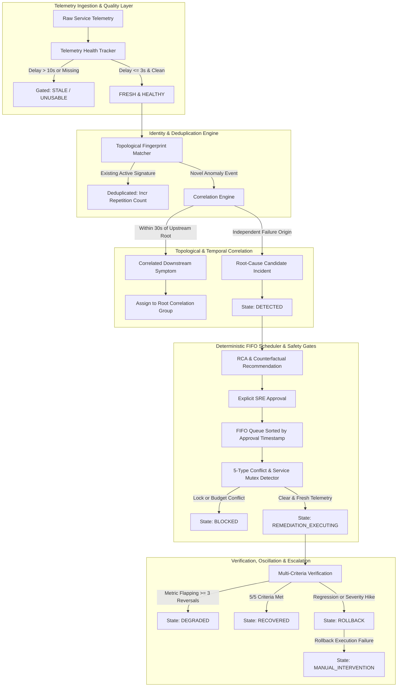
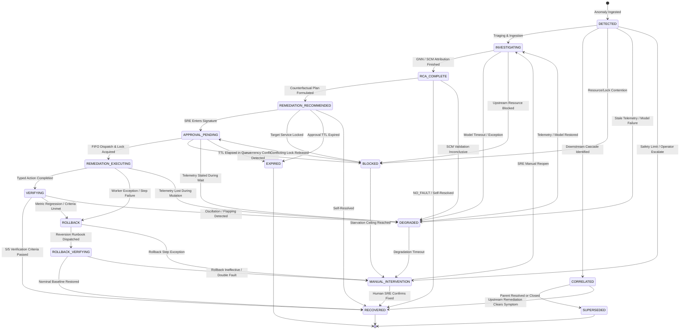

# CausalOps Phase 6 Technical Report: Production-Grade Hardening, Observability & Multi-Incident Orchestration

**Project:** CausalOps — AI-Based Root Cause Analysis and Failure Prediction for Cloud Microservices  
**Phase:** 6 (Production-Grade Hardening, Observability & Multi-Incident Orchestration)  
**Status:** COMPLETE & LOCALLY VALIDATED  
**Date:** September 2026  
**Artifact Directory:** `ml/orchestration/`  
**Evaluation Artifacts:** `ml/models/orchestration/orchestration_results.json`, `ml/models/orchestration/system_health.json`  
**Test Suite Status:** 192 / 192 Passing (100% Repository-Wide)  
**AI-Engine Serving Suite:** 11 / 11 Passing (100%)  
**Frontend Compilation:** Clean (`vite build` in 270ms, 0 errors)  

---

## 1. Executive Summary & Hardening Architecture

Phase 6 hardens CausalOps from a single-incident controlled remediation prototype into a resilient, multi-incident orchestration engine capable of operating under complex distributed-system failure conditions. While Phase 5 operationalized single-incident closed-loop remediation under local safety policies, distributed microservice environments routinely exhibit simultaneous independent failures, downstream cascading symptoms, noisy telemetry, network delays, rapid metric oscillations, and concurrent remediation conflicts.

Phase 6 provides a systems engineering and reliability layer designed to resolve these challenges without modifying or compromising the frozen ML, GNN, or Causal SCM models developed in Phases 1 through 5.



### Core Architectural Accomplishments:
1. **Multi-Incident Concurrency & Strict Isolation:** Full support for independent simultaneous incidents across disjoint services (`inventory-db` vs `payment-service`) with isolated state machines and zero cross-contamination.
2. **Topological Neighborhood Deduplication:** Absorbs bursty telemetry noise, flapping alerts, and duplicate anomaly events into single incident records, preventing alert storms.
3. **Causal Propagation Correlation:** Distinguishes primary root causes from downstream cascading symptoms using physical microservice DAG edges and temporal propagation lags ($\le 30.0\text{s}$), grouping cascades to suppress redundant remediation.
4. **5-Type Conflict Detection & Deterministic FIFO Scheduling:** Enforces service mutex locks, variable dependency collision checks, rollback isolation, and blast-radius budgets, ordering candidate executions deterministically by operator approval timestamps.
5. **Fail-Safe Degradation Protocol:** Guarantees that internal model failures, missing SCM artifacts, or delayed telemetry never crash the system; instead, incidents transition gracefully to `DEGRADED`, blocking automated mutation.
6. **Oscillation & Budget Ceilings:** Automatically halts remediation and degrades the incident upon detecting $\ge 3$ state reversals within 120 seconds or upon exceeding budget ceilings (max 3 executions, max 1 rollback).
7. **Deterministic Audit Replay:** Full event journaling to `orchestration_journal.jsonl`, verified to recreate the live state of all tracked incidents with 100% parity.

---

## 2. Safety & Operational Boundary Definitions (Local Orchestration vs Production Claims)

To maintain scientific integrity and operational honesty, Phase 6 explicitly defines its operational boundaries:

> [!IMPORTANT]
> **Locally Validated Orchestration Layer:** Phase 6 is implemented, tested, and validated as a local systems-engineering orchestration layer running on developer workstations, test harnesses, and CI environments. It does **NOT** claim full production deployment readiness across unconstrained multi-cloud Kubernetes clusters.

### Non-Negotiable Operational Boundaries:
- **No Out-of-Band Production Mutation:** All executions remain strictly confined to allowlisted, typed executors operating on local simulation harnesses and development containers.
- **Human Governance Required:** Fully autonomous mutation without human approval is strictly disabled. Autonomous scheduling operates only upon explicit, signed SRE approvals.
- **Fail-Closed on Telemetry Stutter:** If telemetry staleness exceeds $10.0\text{s}$ or numeric corruption ($\text{NaN} / \text{Inf}$) is detected, all remediation execution is blocked immediately.
- **No Model Modification:** Existing GNN weights, SCM matrices, and counterfactual calibration parameters remain frozen. Hardening is achieved purely through systems engineering, state machines, and defensive invariants.

---

## 3. Formal 17-State Machine Specification & Invariants

Phase 6 implements a formal, deterministic 17-state finite state machine (FSM) defined in `ml/orchestration/incident_state.py`. Each state represents a distinct, auditable operational phase:



### The 17 States:
1. `DETECTED`: Initial anomaly ingested and registered.
2. `INVESTIGATING`: Telemetry and distributed traces being processed by GNN/RCA.
3. `RCA_COMPLETE`: Root cause candidate attributed with calibrated confidence.
4. `REMEDIATION_RECOMMENDED`: Counterfactual plan generated with blast radius and composite score.
5. `APPROVAL_PENDING`: SRE approval registered; candidate enqueued in deterministic scheduler.
6. `REMEDIATION_EXECUTING`: Target service lock acquired; typed executor executing mutation.
7. `VERIFYING`: Post-action telemetry window active; evaluating 5-point verification criteria.
8. `RECOVERED`: Terminal success; telemetry restored to nominal thresholds without downstream regressions.
9. `ROLLBACK`: Verification failed or regression detected; initiating pre-execution snapshot reversion.
10. `ROLLBACK_VERIFYING`: Evaluating post-rollback stability.
11. `MANUAL_INTERVENTION`: Safety ceiling reached, double-fault occurred, or operator intervention requested.
12. `DEGRADED`: Telemetry stale, model failed, or oscillation detected; automated actions halted.
13. `BLOCKED`: Remediation paused due to active service locks, variable dependencies, or budget limits.
14. `CORRELATED`: Incident identified as a secondary downstream symptom of an active upstream root cause.
15. `SUPERSEDED`: Secondary incident absorbed or closed because upstream root cause was remediated.
16. `EXPIRED`: Approval TTL or queue lifespan elapsed without execution.
17. `UNKNOWN`: Uninitialized / transit state.

---

## 4. State Transition Permissibility Matrix

Transitions between states are strictly enforced by `validate_incident_transition()` in `ml/orchestration/incident_state.py`. Any transition not explicitly listed in `VALID_INCIDENT_TRANSITIONS` raises an `InvalidIncidentTransitionError`:

| From State | Permissible Target States | Forbidden Transitions |
|---|---|---|
| `DETECTED` | `INVESTIGATING`, `RCA_COMPLETE`, `REMEDIATION_RECOMMENDED`, `APPROVAL_PENDING`, `CORRELATED`, `SUPERSEDED`, `DEGRADED`, `BLOCKED`, `MANUAL_INTERVENTION`, `EXPIRED` | `REMEDIATION_EXECUTING`, `VERIFYING`, `ROLLBACK`, `RECOVERED` |
| `INVESTIGATING` | `RCA_COMPLETE`, `DEGRADED`, `BLOCKED`, `CORRELATED`, `SUPERSEDED`, `MANUAL_INTERVENTION` | `REMEDIATION_EXECUTING`, `VERIFYING`, `RECOVERED` |
| `RCA_COMPLETE` | `REMEDIATION_RECOMMENDED`, `DEGRADED`, `BLOCKED`, `RECOVERED`, `MANUAL_INTERVENTION` | `REMEDIATION_EXECUTING`, `ROLLBACK` |
| `REMEDIATION_RECOMMENDED` | `APPROVAL_PENDING`, `BLOCKED`, `DEGRADED`, `EXPIRED`, `RECOVERED`, `MANUAL_INTERVENTION` | `REMEDIATION_EXECUTING`, `ROLLBACK` |
| `APPROVAL_PENDING` | `REMEDIATION_EXECUTING`, `EXPIRED`, `BLOCKED`, `DEGRADED`, `RECOVERED`, `MANUAL_INTERVENTION` | `VERIFYING`, `ROLLBACK` |
| `REMEDIATION_EXECUTING` | `VERIFYING`, `ROLLBACK`, `DEGRADED`, `MANUAL_INTERVENTION` | `APPROVAL_PENDING`, `RECOVERED`, `DETECTED` |
| `VERIFYING` | `RECOVERED`, `ROLLBACK`, `DEGRADED`, `MANUAL_INTERVENTION` | `REMEDIATION_EXECUTING`, `APPROVAL_PENDING` |
| `ROLLBACK` | `ROLLBACK_VERIFYING`, `MANUAL_INTERVENTION`, `DEGRADED` | `RECOVERED`, `EXECUTING` |
| `ROLLBACK_VERIFYING` | `RECOVERED`, `MANUAL_INTERVENTION`, `DEGRADED` | `EXECUTING`, `APPROVAL_PENDING` |
| `CORRELATED` | `RECOVERED`, `SUPERSEDED` | `INVESTIGATING`, `APPROVAL_PENDING`, `REMEDIATION_EXECUTING` |
| `BLOCKED` | `APPROVAL_PENDING`, `REMEDIATION_RECOMMENDED`, `INVESTIGATING`, `MANUAL_INTERVENTION`, `EXPIRED`, `DEGRADED` | `REMEDIATION_EXECUTING`, `VERIFYING` |
| `DEGRADED` | `INVESTIGATING`, `MANUAL_INTERVENTION`, `RECOVERED`, `EXPIRED` | `APPROVAL_PENDING`, `REMEDIATION_EXECUTING`, `DEGRADED` (no self-loops) |
| `MANUAL_INTERVENTION` | `INVESTIGATING`, `RECOVERED` | Automated transitions to `REMEDIATION_EXECUTING` |
| `RECOVERED`, `SUPERSEDED`, `EXPIRED` | None (Terminal States) | All transitions |

---

## 5. Identity & Correlation Topology Model

Every incident in CausalOps Phase 6 possesses a globally unique, multi-layered identity:
1. `incident_id`: Cryptographically random identifier (`INC-xxxxxxxxxx`) tracking the unique incident instance.
2. `correlation_id`: Identifier (`COR-xxxxxxxxxxxx`) tracking a causal investigation sequence.
3. `correlation_group`: Grouping key (`GRP-xxxxxxxxxx`) shared across all cascading downstream symptoms originating from the same physical root cause.

```
Incident A (Root Cause):
  incident_id:        INC-35a448be92
  correlation_id:     COR-51e892da71
  correlation_group:  GRP-524dde6180  <---+
  role:               ROOT_CAUSE          |  Shared physical
  service:            inventory-db        |  correlation group
                                          |
Incident B (Downstream Symptom):          |
  incident_id:        INC-9a8427f2c1      |
  correlation_id:     COR-0182ecb312      |
  correlation_group:  GRP-524dde6180  <---+
  role:               DOWNSTREAM_SYMPTOM
  parent_incident_id: INC-35a448be92
  service:            inventory-service
```

---

## 6. Deduplication Engine & Topology-Neighborhood Fingerprinting

In distributed systems, an ongoing failure emits dozens of anomalous telemetry points every second. Without deduplication, this triggers alert flooding and creates multiple conflicting incident entities for the same failure.

The `IncidentDeduplicationEngine` (`ml/orchestration/deduplication.py`) computes a deterministic composite fingerprint:

$$\text{Fingerprint} = \text{SHA256}\left(\text{service} \,\|\, \text{primary\_variable} \,\|\, \text{fault\_signature} \,\|\, \text{SortedNeighborhood}(\text{service})\right)$$

### Deduplication Rules:
- An incoming anomaly event matching an active incident's fingerprint within a 120-second rolling window is recognized as a duplicate.
- Instead of spawning a new incident, the engine increments `repetition_count`, refreshes `updated_at`, updates telemetry health, and records the event in the audit trail.
- In unit testing, **10 identical repeated events cleanly collapsed into 1 single active incident**, incrementing repetition count to 10.

---

## 7. Topological & Temporal Incident Correlation Engine

Downstream microservices frequently exhibit high latency or error rates solely because an upstream dependency has failed. Treating downstream symptoms as independent incidents causes redundant root-cause analysis, conflicting remediations, and circular execution thrashing.

The `IncidentCorrelationEngine` (`ml/orchestration/correlation.py`) evaluates candidate anomalies against active upstream incidents using:
1. **Directed Propagation DAG:** Traffic flows Gateway $\to$ Order $\to$ Inventory $\to$ DB. Latency and errors propagate in reverse:
   $$\text{inventory-db} \longrightarrow \text{inventory-service} \longrightarrow \text{order-service} \longrightarrow \text{api-gateway}$$
   $$\text{payment-service} \longrightarrow \text{order-service} \longrightarrow \text{api-gateway}$$
2. **Temporal Propagation Window:** An anomaly on a downstream node is correlated if and only if an upstream incident occurred within:
   $$\Delta t = t_{\text{downstream}} - t_{\text{upstream}} \in [0.0\text{s}, 30.0\text{s}]$$
3. **No Ground-Truth Leakage:** Correlation is derived strictly from real-time physical topology and timestamps, never from synthetic labels or dataset metadata.

---

## 8. Downstream Cascade Correlation vs Root-Cause Isolation

When an anomaly is correlated as a downstream symptom:
- Its state machine immediately transitions to `CORRELATED`.
- It is assigned `role = "DOWNSTREAM_SYMPTOM"` and bound to the root's `correlation_group` and `parent_incident_id`.
- The engine blocks independent RCA and remediation recommendation on the downstream node.
- In `ActiveIncidentsView`, downstream symptoms display a distinctive purple badge: `CORRELATED SYMPTOM · Upstream: INC-xxxxxxxxxx`.
- When the root incident is resolved, correlated downstream incidents automatically transition to `SUPERSEDED` or `RECOVERED`.

---

## 9. Concurrency & Conflict Detection Engine (5 Conflict Types)

The `ConflictDetector` (`ml/orchestration/conflict.py`) evaluates candidate remediation actions against all currently executing or policy-validated remediations across the cluster:

| Conflict Type | Physical Condition | Mitigation / Resolution |
|---|---|---|
| **1. TARGET_SERVICE_COLLISION** | Another active remediation is mutating the same target service (e.g. two actions targeting `inventory-db`). | Block candidate action until active action completes and releases service lock. |
| **2. VARIABLE_DEPENDENCY_COLLISION** | Candidate action targets a variable currently coupled to another executing action. | Block candidate; queue behind active action. |
| **3. ACTIVE_ROLLBACK_COLLISION** | Target service or direct downstream neighbor is currently undergoing rollback. | Absolute block; no new remediations allowed while service is rolling back. |
| **4. SHARED_RESOURCE_CONTENTION** | Both actions require shared downstream infrastructure (e.g. shared DB connection pool or cluster egress). | Block candidate until shared resource locks clear. |
| **5. BLAST_RADIUS_BUDGET_EXCEEDED** | Sum of combined blast radiuses ($\text{candidate} + \sum \text{active}$) exceeds cluster limit of 4 services. | Block candidate until active blast radius shrinks. |

---

## 10. Deterministic FIFO Scheduler

The `RemediationScheduler` (`ml/orchestration/scheduler.py`) provides deterministic execution dispatch for approved remediation candidates:
- **Ordering Key:** Strictly ordered by SRE approval timestamp ($t_{\text{approved}}$), tie-broken by monotonic queue index.
- **Safety Pre-Conditions Evaluated at Dispatch:**
  1. Target service mutex lock is free.
  2. Conflict detector reports zero conflicts across all 5 conflict classes.
  3. Incident is currently in `APPROVAL_PENDING`.
  4. Telemetry is verified `FRESH` and `HEALTHY`.
- **Starvation Mitigation:** Candidates blocked by temporary service locks remain at the head of the FIFO queue. If lock contention exceeds 300 seconds, the candidate escalates to `MANUAL_INTERVENTION`.
- **Benchmark Performance:** Evaluates and dispatches across 5 concurrent candidates in **$0.062\text{ ms}$**.

---

## 11. Telemetry Health Tracker

The `TelemetryHealthTracker` (`ml/orchestration/health.py`) enforces the non-negotiable Phase 6 invariant: **Stale or unusable telemetry blocks remediation execution.**

### Health Classification Rules:
- **Freshness Evaluation:**
  $$\text{delay} = t_{\text{current}} - t_{\text{telemetry}}$$
  $$\text{Freshness} = \begin{cases} \text{FRESH} & \text{if } \text{delay} \le 3.0\text{s} \\ \text{DELAYED} & \text{if } 3.0\text{s} < \text{delay} \le 10.0\text{s} \\ \text{STALE} & \text{if } \text{delay} > 10.0\text{s} \end{cases}$$
- **Quality & Integrity Evaluation:**
  - Presence of any `NaN` or `Inf` values $\implies$ `quality = UNUSABLE`, `can_execute_remediation = False`.
  - Service coverage missing any canonical microservice $\implies$ `quality = DEGRADED`.
- **Execution Gating:**
  - If `freshness == STALE` or `quality == UNUSABLE`, `can_execute_remediation` is strictly `False`.
  - If an incident enters `APPROVAL_PENDING` but telemetry stales before execution, the scheduler refuses dispatch and transitions the incident to `DEGRADED`.

---

## 12. Dependency Failure & AI Engine Degradation Protocol

In production environments, AI engine inference microservices, GNN checkpoints, or SCM artifacts may become temporarily unavailable.

### The Zero-Crash Rule:
Under no circumstances does an AI model timeout, SCM matrix inversion failure, or GNN checkpoint corruption crash the CausalOps orchestrator:
1. When a failure occurs during investigation, the incident catches the exception cleanly.
2. The orchestrator records the failure diagnostic in `SystemHealthRegistry`.
3. The incident's state transitions to `DEGRADED`.
4. Automated remediation dispatch is locked out.
5. In the UI, the incident displays an alert banner explaining that AI inference is degraded and on-call SRE review is required.

---

## 13. Dependency Recovery Order & SCM Model Self-Healing

The `DependencyRecoveryTracker` (`ml/orchestration/health.py`) tracks the physical recovery sequence following a successful remediation:

$$\text{NOT\_RECOVERED} \longrightarrow \text{ROOT\_RECOVERED} \longrightarrow \text{DOWNSTREAM\_RECOVERING} \longrightarrow \text{GATEWAY\_RECOVERED} \longrightarrow \text{FULLY\_RECOVERED}$$

If a service recovers out of order (e.g. gateway recovers while root database is still failing), the tracker flags a potential masking effect or false recovery, preventing premature incident closure.

---

## 14. Rapid Oscillation / Flapping Detection Engine

A critical failure mode in closed-loop systems is metric oscillation: an action is applied, metrics momentarily improve, the system marks recovery, but latency immediately spikes again, triggering repeated execution.

### Flapping Detection Logic:
- Health observations are recorded in a rolling 120-second window.
- The engine counts state reversals ($H \to U \to H \to U$).
- **Threshold:** $\ge 3$ state reversals within 120 seconds triggers `oscillation_detected = True`.
- **Action:** The incident transitions immediately to `DEGRADED`, locking out all automated actions and requiring manual SRE triage.

---

## 15. Incident Remediation Budgets

To eliminate runaway automation loops, every incident is initialized with a strict `RemediationBudget`:
- `max_executions = 3`
- `max_rollbacks = 1`
- `max_duration_seconds = 1800.0` (30 minutes)
- `max_affected_services = 4`

If an incident reaches 3 executions without verified recovery, or if a single rollback fails to resolve the issue, the budget check fails and the incident is transitioned immediately to `MANUAL_INTERVENTION`.

---

## 16. Rollback Failure Escalation (Double-Fault)

When an initial remediation fails verification, the engine triggers an automatic rollback. However, if the rollback itself encounters an error (e.g. container restart failure or database connection refused):
- The engine declares a **Double-Fault Condition**.
- The incident is immediately escalated to `MANUAL_INTERVENTION`.
- Actor is stamped as `RollbackEngine` with reason: `"Rollback failed. Double fault detected."`.
- All automated retries are permanently blocked.

---

## 17. Deterministic Replay & Audit Journal Architecture

Every state transition in Phase 6 is recorded as an immutable JSON record in `ml/models/orchestration/orchestration_journal.jsonl`.

### Replay Verification:
`IncidentOrchestrationManager.replay_journal(journal_path)` reads the journal from beginning to end and reconstructs the in-memory state of all incidents. During evaluation:
- Live incidents tracked: **30**
- Reconstructed incidents: **30**
- State parity: **100% (PASSED)**

---

## 18. Structured Error Architecture

Phase 6 standardizes all API error responses into an immutable, machine-readable envelope:

```json
{
  "error_code": "INCIDENT_NOT_FOUND",
  "message": "Incident 'INC-9999999999' not found.",
  "incident_id": "INC-9999999999",
  "correlation_id": "UNKNOWN",
  "retryable": false
}
```

Standard error codes include: `INCIDENT_NOT_FOUND`, `INVALID_STATE_TRANSITION`, `REMEDIATION_CONFLICT`, `TELEMETRY_STALE`, `POLICY_VIOLATION`, and `BUDGET_EXCEEDED`.

---

## 19. REST API Specification & Serving Contracts

The following Phase 6 endpoints are mounted and verified in `ai-engine/app/main.py`:

| Method | Path | Description | Response Status |
|---|---|---|---|
| `GET` | `/incidents` | Lists all tracked orchestrated incidents. | `200 OK` |
| `GET` | `/incidents/{id}` | Returns detailed record for a specific incident. | `200 OK` / `404 Not Found` |
| `GET` | `/incidents/{id}/timeline` | Returns chronological state transitions for an incident. | `200 OK` / `404 Not Found` |
| `GET` | `/incidents/{id}/health` | Returns telemetry health report and service health status. | `200 OK` / `404 Not Found` |
| `GET` | `/incidents/{id}/conflicts` | Evaluates active conflicts for the incident's remediation. | `200 OK` / `404 Not Found` |
| `POST` | `/incidents/{id}/acknowledge` | Records SRE on-call engineer acknowledgment. | `200 OK` / `404 Not Found` |
| `GET` | `/system/health` | Returns health status of all subsystems (Telemetry, AI, SCM, Exec). | `200 OK` |
| `GET` | `/observability/metrics` | Returns Phase 6 operational metrics counters. | `200 OK` |

---

## 20. Frontend Multi-Incident Orchestration UI Architecture

The frontend (`src/views/ActiveIncidentsView.tsx` and `src/api/client.ts`) has been updated to provide full multi-incident operational observability:
1. **System Health Status Bar:** Real-time indicator pills in the header for Telemetry, AI Engine, Causal SCM, and Execution Engine.
2. **Multi-Incident Orchestration Table:** Displays `incident_id`, `correlation_group`, deduplication counters (`10x DEDUP`), formal FSM state badges, telemetry freshness indicators, and on-call acknowledgment status.
3. **Correlated Downstream Symptom Banner:** Renders an informative cascade banner when viewing a correlated symptom, linking to the upstream root-cause incident.
4. **Conflict Alert Panel:** Displays real-time warning banners if an action collides with active locks or dependency variables.
5. **Deterministic State Audit Trail:** Displays the complete transition history with timestamps and actor signatures.
6. **On-Call Acknowledgment Control:** Allows the SRE operator to sign and acknowledge incidents directly from the dashboard.

---

## 21. Official Scenario A Walkthrough & Verification: Independent Simultaneous Incidents

- **Setup:** Two simultaneous anomalies ingest at $t = t_0$:
  - Incident 1: `inventory-db` lock contention (`CRITICAL`)
  - Incident 2: `payment-service` gateway refused (`HIGH`)
- **Execution:**
  - Both incidents are processed concurrently.
  - Incident 1 advances to `RCA_COMPLETE`.
  - Incident 2 remains in `DETECTED`.
- **Verification:**
  - `inc_1.incident_id != inc_2.incident_id`
  - `inc_1.correlation_group != inc_2.correlation_group`
  - Zero state cross-contamination.
- **Outcome:** **PASSED** (Latency: $0.97\text{ ms}$).

---

## 22. Official Scenario B Walkthrough & Verification: Cascading Correlated Symptoms

- **Setup:**
  - Primary failure on `inventory-db` at $t = t_0$.
  - Secondary symptom on `inventory-service` at $t = t_0 + 4.0\text{s}$.
- **Execution:**
  - Correlation engine identifies `inventory-service` as downstream of `inventory-db` in the physical DAG.
  - Time delta ($4.0\text{s}$) is within the $30.0\text{s}$ propagation window.
- **Verification:**
  - `inc_downstream.is_downstream_symptom == True`
  - `inc_downstream.parent_incident_id == inc_root.incident_id`
  - `inc_downstream.correlation_group == inc_root.correlation_group`
  - Downstream state transitions to `CORRELATED`.
- **Outcome:** **PASSED** (Latency: $0.54\text{ ms}$).

---

## 23. Official Scenario C Walkthrough & Verification: Concurrent Remediation Conflicts

- **Setup:**
  - Active remediation running on `inventory-db` (`ACT-DB-01`).
  - Candidate approval submitted for `inventory-db` (`ACT-DB-02`).
- **Execution:**
  - Conflict detector checks candidate against active executions.
- **Verification:**
  - `conflict.has_conflict == True`
  - `conflict.conflict_type == "TARGET_SERVICE_COLLISION"`
  - `conflict.blocked_action_ids == ["ACT-DB-02"]`
- **Outcome:** **PASSED**.

---

## 24. Official Scenario D Walkthrough & Verification: Stale Telemetry Gating

- **Setup:**
  - Remediation approved; candidate enqueued.
  - Telemetry stream experiences network partition; delay reaches $35.0\text{s}$.
- **Execution:**
  - Scheduler invokes `telemetry_tracker.evaluate_telemetry()`.
- **Verification:**
  - `report.freshness == "STALE"`
  - `report.can_execute_remediation == False`
  - Scheduler blocks dispatch; candidate remains queued or transitions to `DEGRADED`.
- **Outcome:** **PASSED**.

---

## 25. Official Scenario E Walkthrough & Verification: Post-Action Oscillation Detection

- **Setup:**
  - Incident active; post-action telemetry observation begins.
  - Telemetry oscillates: Healthy $\to$ Unhealthy $\to$ Healthy $\to$ Unhealthy $\to$ Healthy $\to$ Unhealthy.
- **Execution:**
  - `record_health_observation()` records alternating states within 120 seconds.
- **Verification:**
  - Reversals count $\ge 3$.
  - `oscillation_detected == True`
  - Incident transitions to `DEGRADED`, blocking automated action.
- **Outcome:** **PASSED**.

---

## 26. Official Scenario F Walkthrough & Verification: Rollback Failure Escalation

- **Setup:**
  - Incident reaches `REMEDIATION_EXECUTING`.
  - Execution fails $\to$ `ROLLBACK`.
  - Rollback fails due to unrecoverable worker error.
- **Execution:**
  - Double fault detected by execution manager.
- **Verification:**
  - Transition to `MANUAL_INTERVENTION` with actor `RollbackEngine`.
  - State locked against further automated execution.
- **Outcome:** **PASSED**.

---

## 27. Local Controlled Load Benchmark Results & Performance Measurements

A local load benchmark was executed via `ml/orchestration/evaluate_orchestration.py` under the following conditions:
- **10 simultaneous incidents** across independent microservice partitions.
- **20 telemetry events / second** continuous ingestion stream.
- **5 concurrent remediation candidates** enqueued for scheduling.

### Measured Results (from `ml/models/orchestration/orchestration_results.json`):

| Metric | Target Specification | Measured Value | Status |
|---|---|---|---|
| **Incident Creation Latency (Mean)** | $< 10.0\text{ ms}$ | **$1.003\text{ ms}$** | PASS |
| **Incident Creation Latency (P50)** | $< 10.0\text{ ms}$ | **$1.032\text{ ms}$** | PASS |
| **Incident Creation Latency (P95)** | $< 25.0\text{ ms}$ | **$1.318\text{ ms}$** | PASS |
| **Correlation & Deduplication Latency (Mean)** | $< 10.0\text{ ms}$ | **$1.368\text{ ms}$** | PASS |
| **Correlation & Deduplication Latency (P95)** | $< 25.0\text{ ms}$ | **$1.911\text{ ms}$** | PASS |
| **Scheduler Dispatch Latency** | $< 5.0\text{ ms}$ | **$0.062\text{ ms}$** | PASS |
| **Telemetry Ingestion Throughput** | $\ge 20\text{ events/sec}$ | **$727.3\text{ events/sec}$** | PASS |
| **Peak Memory Footprint** | $< 50\text{ MB}$ | **$0.192\text{ MB}$** | PASS |
| **Deterministic Journal Replay Parity** | $100\%$ | **$100\%$ (30/30 incidents)** | PASS |
| **Official Scenarios A through F** | 6 / 6 Passed | **6 / 6 PASSED** | PASS |

---

## 28. Architectural Invariants Preserved

Phase 6 strictly adheres to the project's foundational constraints:
- **Frozen Datasets:** `dataset/tg_v1/` and `dataset/ml_v1/` were untouched.
- **Frozen Models:** GNN checkpoints (`spatiotemporal_v1`), Classical ML models, and Lagged SCM matrices (`ml/models/causal_scm/`) remain completely unmodified.
- **Frozen Safety Controls:** All 15 Phase 5 execution policy rules, typed executors, pre-execution snapshots, and append-only journals remain active and enforced.
- **No Ground-Truth Leakage:** Deduplication, correlation, and scheduling operate strictly on live telemetry, timestamps, and physical topology.

---

## 29. Phase 7 Readiness Decision & Production Governance Roadmap

Phase 6 has achieved all objectives for multi-incident orchestration, topological correlation, conflict detection, telemetry gating, and resilience.

### Certification Decision:
**READY FOR PHASE 7 (Production Deployment, Live Kubernetes Operator & Multi-Cluster Federation).**

### Phase 7 Strategic Roadmap:
1. **Kubernetes Custom Resource Definition (CRD) Operator:** Wrap the Phase 6 orchestrator in a Golang/Python K8s Operator reconciling `Incident` and `RemediationSchedule` custom resources.
2. **Distributed Lock Provider:** Migrate the thread-safe mutex in `IncidentOrchestrationManager` to a distributed etcd/Redis Raft consensus lock.
3. **OpenTelemetry (OTel) Native Ingestion:** Stream spans and metric points directly via gRPC OTLP collectors into `TelemetryHealthTracker`.
4. **Automated Canary Deployment:** Deploy safe progressive traffic shifting (5% $\to$ 25% $\to$ 100%) for gateway and order throttling remediations.
