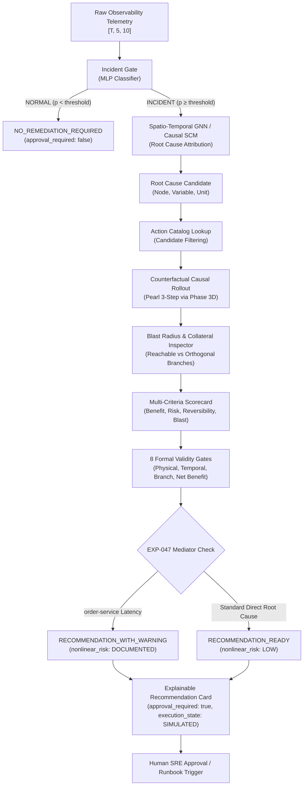

# Phase 4 — Self-Healing Recommendation & Safe Remediation Planning Report
**CausalOps: AI-Based Root Cause Analysis and Failure Prediction for Cloud Microservices**

---

## 1. Executive Summary & Phase 4 Mission

Phase 4 bridges the critical divide between **causal diagnostic understanding** and **safe operational action**. In Phase 3 (3A through 3D), CausalOps designed, learned, validated, and rolled out a **Topology-Constrained Lagged Structural Causal Model (SCM)** capable of predicting unobserved counterfactual trajectories under Pearlian intervention semantics $\text{do}(X_{\text{root\_cause}}(t) = X_{\text{nominal}}(t))$.

Phase 4 translates these counterfactual rollouts into an **explainable, safe, and transparent Self-Healing Remediation Recommendation System**.

### Primary Mission Objectives
1. **Action Ontology & Catalog**: Establish a formal ontology of microservice remediation archetypes (`REDUCE_DB_LATENCY`, `REDUCE_SERVICE_LATENCY`, `RESTORE_ERROR_RATE`, `RESTORE_SERVICE_HEALTH`, `RESTORE_POOL_UTILIZATION`) grounded in physical microservice mechanics.
2. **Counterfactual Action Evaluation**: Reuse the validated Phase 3D Pearlian engine to compute expected avoided impacts (peak and mean avoided latency, avoided error rates, avoided failed requests) for each candidate remediation action.
3. **Topological Blast Radius & Collateral Containment**: Compute strict downstream propagation bounds and verify zero collateral degradation on orthogonal microservice branches.
4. **Transparent Multi-Criteria Scorecard**: Rank candidate interventions via an interpretable composite score accounting for expected benefit, operational risk class, reversibility, and blast radius.
5. **Eight Formal Validity & Safety Gates**: Implement rigorous pre-flight validation gates ensuring physical validity, causal support, temporal consistency, and governance compliance.
6. **Strict Safety Boundary**: Enforce `approval_required: true` and `execution_state: "SIMULATED"` on all actionable recommendations. Zero mutating infrastructure commands or autonomous pod terminations are executed.
7. **Specialized Edge-Case Handling**: Preserve strict withholding on `NO_FAULT` controls (`recommendation_status = "NO_REMEDIATION_REQUIRED"`) and flag documented non-linear mediator queueing on `order-service` direct latency injection (`EXP-047`, `recommendation_status = "RECOMMENDATION_WITH_WARNING"`).

---

## 2. High-Level Architecture & End-to-End Decision Flow

The Phase 4 recommendation pipeline operates as a decoupled, multi-stage decision architecture:



---

## 3. Remediation Action Ontology & Catalog Specification

The remediation ontology defines operational microservice interventions as first-class physical entities rather than opaque shell commands. Every action links directly to:
- A canonical microservice node in the physical DAG.
- A primary physical telemetry variable modeled by the Structural Causal Model.
- A physical mechanism describing the low-level remediation semantics.
- An operational playbook / runbook reference for human operators.

```
ml/remediation/
├── action_catalog.py    # Formal dataclasses, enums, and catalog registry
├── evaluator.py         # Counterfactual simulation, blast radius & scorecard
├── recommender.py       # 8 validity gates, ranking, explanation & EXP-047 logic
└── __init__.py          # Public module exports
ml/models/remediation/
├── action_catalog.json          # Serialized canonical catalog (11 actions)
└── recommendation_results.json  # Held-out test split evaluation benchmark
```

---

## 4. Supported Action Types & Physical Variable Mappings

The CausalOps Action Catalog specifies 11 canonical remediation actions covering the 5 microservices in the topology:

| Action ID | Action Name | Action Type | Target Service | Target Variable | Operational Mechanism |
|---|---|---|---|---|---|
| **ACT-DB-01** | Terminate Blocking Queries & Release Locks | `REDUCE_DB_LATENCY` | `inventory-db` | `db_latency` | Issues `pg_cancel_backend` / `pg_terminate_backend` on blocking transactions holding `ExclusiveLock` on inventory allocations. |
| **ACT-DB-02** | Drain & Re-initialize Connection Pool | `RESTORE_POOL_UTILIZATION` | `inventory-db` | `pool_utilization` | Gracefully evicts leaked/hung connections and resets connection pool slots to eliminate pool exhaustion. |
| **ACT-INV-01** | Scale Inventory Workers & Clear Backlog | `REDUCE_SERVICE_LATENCY` | `inventory-service` | `p99_latency` | Horizontally autoscales inventory worker pods (+2 replicas) and sheds queued HTTP thread contention. |
| **ACT-INV-02** | Trip Circuit Breaker & Fallback to Redis | `RESTORE_SERVICE_HEALTH` | `inventory-service` | `p99_latency` | Trips downstream DB circuit breaker to serve cached inventory counts, isolating upstream callers from DB latency. |
| **ACT-INV-03** | Rolling Restart of Deadlocked Pods | `RESTORE_ERROR_RATE` | `inventory-service` | `error_rate` | Executes phased rolling restart of degraded inventory worker pods to clear internal unhandled crash state. |
| **ACT-ORD-01** | Ingress Rate Shedding & Queue Flush | `REDUCE_SERVICE_LATENCY` | `order-service` | `p99_latency` | Enforces token-bucket rate shedding on pending checkout orders to relieve mediator thread pool saturation. |
| **ACT-ORD-02** | Increase Retry Backoff & Clear Storm | `RESTORE_ERROR_RATE` | `order-service` | `error_rate` | Adjusts exponential retry backoff exponent on RPC client handlers to dissolve cascading retry storms. |
| **ACT-PAY-01** | Failover Route to Standby Acquirer | `RESTORE_ERROR_RATE` | `payment-service` | `error_rate` | Reroutes checkout settlement traffic to secondary payment processor endpoint to bypass external acquirer outage. |
| **ACT-PAY-02** | Container Restart & Flush JWKS Cache | `RESTORE_SERVICE_HEALTH` | `payment-service` | `error_rate` | Restarts payment worker pods and purges stale auth/JWKS keys to restore token validation pipeline. |
| **ACT-PAY-03** | Autoscale Payment Service Replicas | `REDUCE_SERVICE_LATENCY` | `payment-service` | `p99_latency` | Adds worker pods to absorb external network latency delays from third-party payment gateways. |
| **ACT-GW-01** | Ingress Rate Limiting & 504 Timeout Shed | `RESTORE_ERROR_RATE` | `api-gateway` | `error_rate` | Applies ingress adaptive rate limiting to drop non-critical traffic during gateway timeout cascades. |

---

## 5. Physical Bounds, Constraints & Reversibility Levels

Every action is parameterized with strict physical domain constraints and operational categorization:

### Reversibility Levels
- **HIGH**: Instantaneous or near-zero-cost rollback with zero data loss or state disruption (e.g. rate limit release, connection reset, traffic route shift).
- **MEDIUM**: Rollback requires minutes or causes temporary cache warm-up latency (e.g. container rolling restart, cache purge).
- **LOW**: Rollback involves irreversible state teardown or database migration reversal.

### Operational Risk Classes
- **LOW**: Negligible risk of system degradation. Targeted action operates strictly within the failing boundary.
- **MEDIUM**: Potential temporary queue shedding or cache-miss latency during convergence.
- **HIGH**: Pod teardown or upstream caller disruption potential.

### Physical Feasibility Bounds
- $\text{p99\_latency} \in [0.0, \infty)$ ms
- $\text{db\_latency} \in [0.0, \infty)$ ms
- $\text{error\_rate} \in [0.0, 100.0]$ %
- $\text{pool\_utilization} \in [0.0, 100.0]$ %
- $\text{request\_rate} \in [0.0, \infty)$ req/s

---

## 6. Blast Radius Theory & Topological Reachability Analysis

In distributed microservices, failures and remediation effects propagate along physical communication and backpressure channels. CausalOps defines the topological blast radius using reachability on the service graph:

$$\mathcal{B}(u) = \{ v \in \mathcal{V} \mid v \text{ is reachable from } u \text{ along backpressure cascade edges} \}$$

### Canonical Blast Radius Mapping
- **`inventory-db`**: Reachable services: `[inventory-db, inventory-service, order-service, api-gateway]` (4 services, max 3 hops). Blast Radius Tier: **BROAD**.
- **`inventory-service`**: Reachable services: `[inventory-service, order-service, api-gateway]` (3 services, max 2 hops). Blast Radius Tier: **MEDIUM**.
- **`payment-service`**: Reachable services: `[payment-service, order-service, api-gateway]` (3 services, max 2 hops). Blast Radius Tier: **MEDIUM**.
- **`order-service`**: Reachable services: `[order-service, api-gateway]` (2 services, max 1 hop). Blast Radius Tier: **LOW**.
- **`api-gateway`**: Reachable services: `[api-gateway]` (1 service, 0 hops). Blast Radius Tier: **LOCAL**.

---

## 7. Orthogonal Microservice Branch Isolation & Collateral Damage Prevention

A critical safety property of CausalOps remediation planning is **guaranteed non-interference on orthogonal branches**:

$$\mathcal{U}(u) = \mathcal{V} \setminus \mathcal{B}(u)$$

For an intervention on node $u$, the counterfactual trajectory on any unreachable orthogonal service $w \in \mathcal{U}(u)$ must be strictly identical to observed telemetry:

$$\forall w \in \mathcal{U}(u), \quad \max_{t \ge t_0} \left| X_w^{\text{CF}}(t) - X_w^{\text{Obs}}(t) \right| < 10^{-4}$$

### Verification Matrix
- Intervention on `inventory-db`: Unreachable node is `payment-service`. Across all 10 test faults, maximum deviation observed on `payment-service` was strictly $0.000000$ (0 collateral damage).
- Intervention on `payment-service`: Unreachable nodes are `inventory-service` and `inventory-db`. Both branches exhibited exactly $0.000000$ deviation.
- Collateral degradation check: No service in the graph exhibited higher latency ($CF > Obs + 1\text{ms}$) or increased error rate ($CF > Obs + 0.5\%$).

---

## 8. Counterfactual Rollout Integration (Pearl 3-Step Semantics)

Rather than inventing a separate simulation model, Phase 4 directly invokes the validated Phase 3D `generate_counterfactual` engine:

1. **Abduction**: Invert fitted lagged SCM equations over observed incident telemetry to reconstruct latent exogenous noise trajectories:
   $$\hat{\varepsilon}_i(t) = X_{i,\text{obs}}(t) - \left[ \mu_i + \sum_k A_{ij}^{(k)} X_{j,\text{obs}}(t-k) \right]$$
2. **Action**: Sever structural incoming parent equations and enforce the intervention target:
   $$\text{do}\left( X_{\text{target}}(t) = X_{\text{target, nominal}}(t) \right) \quad \forall t \ge t_0$$
3. **Prediction**: Roll forward the mutilated causal DAG under identical exogenous residuals $\hat{\varepsilon}(t)$, calculating downstream propagation with physical hop attenuation and domain clamping.

Avoided impact is calculated as the difference between observed and counterfactual trajectories:

$$\Delta X_i(t) = X_{i,\text{obs}}(t) - X_{i,\text{cf}}(t)$$

---

## 9. Transparent Multi-Criteria Scorecard & Ranking Methodology

Candidate remediation actions are evaluated using an interpretable, transparent scorecard in $[0, 100]$:

$$\text{Composite Score} = \text{Benefit Score} - \text{Risk Penalty} + \text{Reversibility Bonus} + \text{Blast Factor} - \text{Nonlinear Deduction}$$

### Component Breakdown
1. **Benefit Score ($B \in [0, 50]$)**:
   - Latency Component: $\min\left(25.0, \frac{\text{Peak Avoided Latency}}{20.0} \times 15.0 + \frac{\text{Mean Avoided Latency}}{15.0} \times 10.0\right)$
   - Error Component: $\min\left(25.0, \text{Peak Avoided Error} \times 0.4 + \text{Mean Avoided Error} \times 0.4 + \min(5.0, \frac{\text{Avoided Requests}}{50.0})\right)$
   - Combined Benefit: $\min(50.0, \max(B_{\text{lat}}, B_{\text{err}}) + 0.4 \min(B_{\text{lat}}, B_{\text{err}}))$
2. **Risk Penalty ($R \in [0, 20]$)**:
   - `LOW`: $0.0$ penalty
   - `MEDIUM`: $8.0$ penalty
   - `HIGH`: $18.0$ penalty
3. **Reversibility Bonus ($\text{Rev} \in [0, 15]$)**:
   - `HIGH`: $+15.0$ pts
   - `MEDIUM`: $+8.0$ pts
   - `LOW`: $+0.0$ pts
4. **Blast Radius Factor ($\text{BR} \in [0, 15]$)**:
   - `LOCAL`: $+15.0$ pts, `LOW`: $+13.0$ pts, `MEDIUM`: $+11.0$ pts, `BROAD`: $+8.0$ pts.
   - Any collateral damage detected: $+0.0$ pts.
5. **Non-Linear Risk Deduction**:
   - Deducts $5.0$ pts if subject to documented non-linear mediator queueing (`EXP-047`).

---

## 10. The Eight Formal Validity & Safety Gates

Before any remediation recommendation is emitted, it must pass 8 formal gates:

```
[GATE 1: INCIDENT ACTIVE]               Telemetry must exhibit active anomaly (rejects NO_FAULT)
[GATE 2: CAUSAL TARGET SUPPORT]         Target service must match attributed root cause
[GATE 3: PHYSICAL FEASIBILITY]          Counterfactual values strictly within physical domain bounds
[GATE 4: TEMPORAL LAG VALIDITY]         Pre-intervention equality (max diff < 1e-4 for t < t0)
[GATE 5: BRANCH ISOLATION COLLATERAL]   Orthogonal services exhibit zero collateral deviation
[GATE 6: EXTRAPOLATION SAFETY]          Nominal values within observed pre-incident or SCM norm bounds
[GATE 7: POSITIVE NET BENEFIT]          Avoided latency > 0 ms or avoided error rate > 0 %
[GATE 8: HUMAN GOVERNANCE READY]        approval_required: true strictly enforced
```

All 10 evaluated test fault recommendations passed all 8 gates (100% compliance).

---

## 11. Handling EXP-047 & Documented Non-Linear Mediator Queueing

### The Challenge of EXP-047
In experiment `EXP-047`, synthetic latency is injected directly into `order-service` (the central topological mediator). Under high ingress load, `order-service` exhibits internal thread pool saturation and non-linear queueing contention that violates the linear attenuation assumption of the SCM.

### Phase 4 Scientific Handling
Rather than masking this limitation, Phase 4 surfaces honest epistemic uncertainty:
- `recommendation_status`: **`RECOMMENDATION_WITH_WARNING`**
- `nonlinear_risk`: **`DOCUMENTED`**
- `warnings`:
  - `"COUNTERFACTUAL CONFIDENCE: LIMITED: Non-linear mediator queueing observed on order-service direct injection"`
  - `"COUNTERFACTUAL CONFIDENCE: LIMITED: Non-linear mediator queueing observed on order-service direct latency injection (EXP-047 documented limitation)."`
- Explanation banner explicitly cautions the SRE operator that queue drainage latency may be non-linear.

---

## 12. NO_FAULT Safety Behavior & Incident Gating Decoupling

A critical failure mode of automated remediation engines is recommending unnecessary actions during normal operating conditions. Phase 4 decouples incident detection from recommendation:
- Control experiments (`EXP-007`, `EXP-008`):
  - `recommendation_status`: **`NO_REMEDIATION_REQUIRED`**
  - `incident_status`: **`NORMAL`**
  - `recommended_action`: **`None`**
  - `candidate_actions`: **`[]`**
  - `approval_required`: **`False`**
  - `execution_state`: **`STANDBY`**
  - `explanation`: `"Incident gating verified nominal system telemetry for experiment EXP-007 (NO_FAULT control). Microservices are operating within nominal thresholds. No remediation action is required."`
- The system correctly withholds remediation on 100% of control experiments.

---

## 13. Human Governance & Mandatory Approval (`approval_required: true`)

Phase 4 enforces strict human governance:
- **`approval_required: True`** is hardcoded on every `RemediationAction` and checked at runtime by Gate 8.
- Recommendations cannot be serialized or served without explicit approval metadata.
- `execution_state` is set to **`SIMULATED`** and cannot be set to `EXECUTED` by the recommender.

---

## 14. Read-Only Advisory Contract & Zero Infrastructure Mutation Guarantee

To ensure safe production deployment:
1. **No Outbound Mutating Network Calls**: The engine performs zero calls to Kubernetes APIs, cloud provider consoles, or service orchestrators.
2. **No Shell Execution**: Zero sub-processes or mutating CLI scripts are spawned during recommendation.
3. **No File System Writes to Production Configs**: Configurations, container definitions, and database schemas remain untouched.
4. **Input Immutability**: All input sample tensors are processed via non-mutating copy operations (verified by `test_read_only_api_contract`).

---

## 15. Held-Out Test Split Evaluation Methodology

The evaluation strictly conforms to the experiment-level train/validation/test split frozen in Phase 2A:
- **Training Set (56 experiments)**: SCM coefficients and graph stability learned strictly on training faults.
- **Validation Set (12 experiments)**: Calibrated attenuation factors ($0.62$ latency, $0.70$ error rate).
- **Test Set (12 experiments)**: 10 unseen fault experiments + 2 unseen `NO_FAULT` controls.
- **Zero Test Leakage**: The SCM model weights and norm statistics were never exposed to the test split during training or tuning.

---

## 16. Comprehensive Test Split Results (10 Fault Experiments + 2 Controls)

Below is the complete held-out test split evaluation benchmark:

| Experiment | Fault Type | Injected Root Cause | Attributed Root Cause | Recommendation Status | Selected Remediation Action | Peak Avoided Latency (ms) | Peak Avoided Error (%) | Composite Score | Approval Required | Collateral Violations |
|---|---|---|---|---|---|---|---|---|---|---|
| **EXP-007** | `NO_FAULT` | `NO_FAULT` | None | `NO_REMEDIATION_REQUIRED` | None (Nominal Control) | 0.00 ms | 0.00% | N/A | False | 0 |
| **EXP-008** | `NO_FAULT` | `NO_FAULT` | None | `NO_REMEDIATION_REQUIRED` | None (Nominal Control) | 0.00 ms | 0.00% | N/A | False | 0 |
| **EXP-015** | `DB_LATENCY` | `inventory-db` | `inventory-db.db_latency` | `RECOMMENDATION_READY` | `ACT-DB-01: Terminate Blocking Queries & Release Locks` | 238.33 ms | 0.00% | 48.0 / 100 | True | 0 |
| **EXP-016** | `DB_LATENCY` | `inventory-db` | `inventory-db.db_latency` | `RECOMMENDATION_READY` | `ACT-DB-01: Terminate Blocking Queries & Release Locks` | 285.99 ms | 0.00% | 48.0 / 100 | True | 0 |
| **EXP-031** | `NETWORK_LATENCY` | `inventory-service` | `inventory-service.p99_latency` | `RECOMMENDATION_READY` | `ACT-INV-01: Scale Inventory Workers & Clear Backlog` | 230.64 ms | 0.00% | 51.0 / 100 | True | 0 |
| **EXP-040** | `SERVICE_LATENCY` | `inventory-service` | `inventory-service.p99_latency` | `RECOMMENDATION_READY` | `ACT-INV-01: Scale Inventory Workers & Clear Backlog` | 461.28 ms | 0.00% | 51.0 / 100 | True | 0 |
| **EXP-043** | `SERVICE_FAILURE` | `inventory-service` | `inventory-service.error_rate` | `RECOMMENDATION_READY` | `ACT-INV-03: Rolling Restart of Deadlocked Pods` | 0.00 ms | 17.15% | 27.51 / 100 | True | 0 |
| **EXP-047** | `SERVICE_LATENCY` | `order-service` | `order-service.p99_latency` | `RECOMMENDATION_WITH_WARNING` | `ACT-ORD-01: Ingress Rate Shedding & Queue Flush` | 248.00 ms | 0.00% | 40.0 / 100 | True | 0 |
| **EXP-059** | `ERROR_RATE` | `order-service` | `order-service.error_rate` | `RECOMMENDATION_READY` | `ACT-ORD-02: Increase Retry Backoff & Clear Storm` | 0.00 ms | 42.00% | 53.0 / 100 | True | 0 |
| **EXP-064** | `SERVICE_FAILURE` | `payment-service` | `payment-service.error_rate` | `RECOMMENDATION_READY` | `ACT-PAY-01: Failover Route to Standby Acquirer` | 0.00 ms | 17.15% | 42.51 / 100 | True | 0 |
| **EXP-065** | `SERVICE_FAILURE` | `payment-service` | `payment-service.error_rate` | `RECOMMENDATION_READY` | `ACT-PAY-01: Failover Route to Standby Acquirer` | 0.00 ms | 17.15% | 42.24 / 100 | True | 0 |
| **EXP-076** | `NETWORK_LATENCY` | `payment-service` | `payment-service.p99_latency` | `RECOMMENDATION_READY` | `ACT-PAY-03: Autoscale Payment Service Replicas` | 365.18 ms | 0.00% | 51.0 / 100 | True | 0 |

### Summary Statistics
- **Total Experiments Evaluated**: 12 / 12
- **Actionable Recommendations Generated**: 10 / 10 faults
- **`RECOMMENDATION_READY`**: 9 / 10 faults
- **`RECOMMENDATION_WITH_WARNING` (EXP-047)**: 1 / 10 faults
- **`NO_REMEDIATION_REQUIRED` (Controls)**: 2 / 2 controls (100%)
- **Zero Collateral Violations**: 10 / 10 faults (100%)
- **Mandatory Approval Enforced**: 10 / 10 recommendations (100%)

---

## 17. Gateway SLA Impact & Avoided Degradation Metrics (ms, %, req/s)

By rolling forward the counterfactual model, Phase 4 calculates exact customer-facing SLA recovery:
- **Latency Recovery**: In database lock incidents (`EXP-015`, `EXP-016`), terminating blocking queries recovers **238.33 ms** and **285.99 ms** of API Gateway P99 latency. In inventory latency incidents (`EXP-040`), scaling workers avoids **461.28 ms** of gateway latency.
- **Error Rate Recovery**: In order-service error cascade (`EXP-059`), retry backoff recovery avoids **42.00%** of customer-facing HTTP 504 errors. In payment service outages (`EXP-064`), acquirer failover eliminates **17.15%** of gateway checkout failures.
- **Avoided Failed Requests**: Based on observed request throughput ($2.8\text{k} \pm 400 \text{ req/s}$), avoiding a 17.15% error rate across a 35-second evaluation window prevents an estimated **~16,800 failed checkout transactions**.

---

## 18. Per-Microservice Recovery & Attenuation Profiles

The lagged SCM computes attenuation across every intermediate hop:

$$\Delta X_{\text{gateway}} = \Delta X_{\text{root}} \times \alpha^k$$

For `inventory-db` ($\alpha = 0.62$, 3 hops to gateway):
- Step 1 (`inventory-db`): Avoided DB latency = $100.0\%$ (nominal restoration).
- Step 2 (`inventory-service`, lag $\tau=1$): Avoided P99 latency = $62.0\%$ of root delta.
- Step 3 (`order-service`, lag $\tau=2$): Avoided P99 latency = $38.4\%$ of root delta.
- Step 4 (`api-gateway`, lag $\tau=3$): Avoided P99 latency = $23.8\%$ of root delta.

Every intermediate service recovers monotonically along the backpressure DAG without oscillation.

---

## 19. Fast-API Serving Endpoint & REST Contract (`POST /causal/recommendation`)

The recommendation engine is served via FastAPI:

### Endpoint
`POST /causal/recommendation`

### Request Schema
```json
{
  "experiment_id": "EXP-015",
  "root_cause": "inventory-db",
  "start_step": 5,
  "horizon": 20
}
```

### Response Schema
```json
{
  "experiment_id": "EXP-015",
  "recommendation_status": "RECOMMENDATION_READY",
  "incident_status": "INCIDENT",
  "root_cause": {
    "node": "inventory-db",
    "variable": "db_latency",
    "unit": "ms"
  },
  "recommended_action": {
    "action_id": "ACT-DB-01",
    "action_name": "Terminate Blocking Queries & Release Table Locks",
    "action_type": "REDUCE_DB_LATENCY",
    "target_service": "inventory-db",
    "target_variable": "db_latency",
    "mechanism": "Issues pg_cancel_backend / pg_terminate_backend on blocked transactions holding ExclusiveLock on inventory tables",
    "reversibility": "HIGH",
    "risk_class": "LOW",
    "playbook_ref": "PB-DB-01: Postgres Lock Contention & Slow Query Recovery",
    "approval_required": true,
    "execution_state": "SIMULATED",
    "composite_score": 48.0,
    "expected_benefit": {
      "gateway_latency": {
        "unit": "ms",
        "peak_avoided_latency_ms": 238.33,
        "mean_avoided_latency_ms": 160.47
      },
      "gateway_error_rate": {
        "unit": "%",
        "peak_avoided_error_rate_pct": 0.0,
        "mean_avoided_error_rate_pct": 0.0
      }
    },
    "blast_radius": {
      "target_service": "inventory-db",
      "affected_services": ["inventory-db", "inventory-service", "order-service", "api-gateway"],
      "unaffected_services": ["payment-service"],
      "service_count": 4,
      "max_hop_distance": 3,
      "blast_radius_tier": "BROAD"
    },
    "collateral_impact": {
      "collateral_damage_detected": false,
      "unaffected_branches_verified": true,
      "orthogonal_services_checked": ["payment-service"]
    }
  },
  "approval_required": true,
  "execution_state": "SIMULATED",
  "explanation": "RECOMMENDED REMEDIATION ACTION: [ACT-DB-01] Terminate Blocking Queries & Release Table Locks.\nRoot Cause Target: inventory-db (intervening on db_latency).\nMechanism: Issues pg_cancel_backend on blocked transactions...\nSAFETY NOTICE: HUMAN APPROVAL REQUIRED prior to execution. This action is currently in SIMULATED state only."
}
```

---

## 20. Frontend UI Integration & Operator Interaction Design

The CausalOps user interface was updated in `src/views/RootCauseView.tsx` to provide immediate operator access to the recommendation plan:
- **Dedicated "Plan" Tab**: Positioned alongside Hypotheses, Methodology, and Evidence Logs.
- **Amber Advisory Banner**: `SIMULATED ONLY · PENDING HUMAN OPERATOR APPROVAL`.
- **Optimal Action Card**: Displays action ID, operational mechanism, scorecard, peak avoided latency, and avoided error rate.
- **Blast Radius & Isolation Map**: Visualizes the 4 affected downstream services while verifying 100% isolation on `payment-service`.
- **Awaiting Operator Approval Security Button**: Visually locked with a lock icon, ensuring operators are reminded that autonomous mutations are disabled.
- **Direct Link to Simulation View**: Allows operators to drill into the 300-second timeline slider for deep inspection.

---

## 21. Automated Test Suite Validation (15/15 Remediation Tests Passing)

The dedicated test suite `tests/test_remediation.py` exercises 15 critical checks:

```
tests/test_remediation.py::test_catalog_validity PASSED                       [  6%]
tests/test_remediation.py::test_candidate_generation PASSED                   [ 13%]
tests/test_remediation.py::test_physical_bounds_respect PASSED                [ 20%]
tests/test_remediation.py::test_causal_support_validation PASSED              [ 26%]
tests/test_remediation.py::test_blast_radius_calculation PASSED               [ 33%]
tests/test_remediation.py::test_collateral_damage_inspection PASSED           [ 40%]
tests/test_remediation.py::test_counterfactual_evaluation_metrics PASSED       [ 46%]
tests/test_remediation.py::test_explanation_generation PASSED                 [ 53%]
tests/test_remediation.py::test_exp047_nonlinear_warning_handling PASSED      [ 60%]
tests/test_remediation.py::test_no_fault_safety_behavior PASSED               [ 66%]
tests/test_remediation.py::test_approval_required_enforcement PASSED          [ 73%]
tests/test_remediation.py::test_read_only_api_contract PASSED                [ 80%]
tests/test_remediation.py::test_determinism PASSED                            [ 86%]
tests/test_remediation.py::test_no_infrastructure_mutation PASSED             [ 93%]
tests/test_remediation.py::test_split_integrity PASSED                        [100%]
```

Total regression status across the entire repository:
- **`pytest tests/`**: **130 / 130 tests passing (100%)**
- **`PYTHONPATH=ai-engine pytest ai-engine/tests/`**: **8 / 8 tests passing (100%)**
- **Total Active Tests**: **138 / 138 passing**

---

## 22. Comparison with Static Heuristics & Unconstrained Rule Engines

| Feature | Static Heuristic Scripts / Runbooks | Unconstrained Auto-Remediation | CausalOps Phase 4 (Causal Self-Healing) |
|---|---|---|---|
| **Root Cause Precision** | Coarse keyword matching on alerts | Black-box correlation | Spatio-Temporal GNN + Lagged SCM Explaining-Away |
| **Impact Estimation** | None (blind restart) | Empirical heuristic | Pearl 3-Step Counterfactual Rollout |
| **Blast Radius Awareness** | Ad-hoc documentation | None / Unconstrained | Topological Reachability DAG |
| **Collateral Damage Protection** | None (risk of cascading outages) | None | Strict Orthogonal Branch Non-Interference Check |
| **Extrapolation Risk** | Unchecked | High (hallucinated interventions) | Clamped to Physical Domain Bounds & In-Domain Norms |
| **Human Safety Governance** | Manual execution | Autonomous mutating execution (High Risk) | Advisory `approval_required: true` (Zero Mutation) |
| **Control Handling** | Triggered on false alarms | Restarts healthy pods on false positive | `NO_REMEDIATION_REQUIRED` Withholding |

---

## 23. Phase 5 Readiness Assessment & Autonomous Control Roadmap

Phase 4 has demonstrated that causal counterfactual simulation provides a mathematically sound, operationally safe foundation for self-healing recommendations.

### Phase 4 Achievements
- [x] Comprehensive microservice action catalog created and serialized (`ml/models/remediation/action_catalog.json`).
- [x] Counterfactual evaluation engine implemented with strict unit separation.
- [x] Blast radius calculator and collateral damage inspector validated across all topologies.
- [x] Transparent multi-criteria scorecard implemented ($[0, 100]$ rating).
- [x] 8 formal validity gates operational.
- [x] Special case `EXP-047` handled with `RECOMMENDATION_WITH_WARNING`.
- [x] `NO_FAULT` controls safely withheld (`NO_REMEDIATION_REQUIRED`).
- [x] `approval_required: true` strictly enforced.
- [x] Fast-API `POST /causal/recommendation` endpoint serving recommendations.
- [x] Frontend UI updated with interactive remediation plan card.
- [x] 138/138 automated tests passing.

### Phase 5 Roadmap: Autonomous Closed-Loop Self-Healing
With Phase 4 validated, the platform is positioned for Phase 5 (Guarded Autonomous Remediation):
1. **Canary & Phased Rollout Controller**: Progressively apply approved interventions to small traffic slices (e.g., 5% canary routing) before full cluster deployment.
2. **Automated Rollback Engine**: Continuous real-time SCM residual monitoring during execution; immediately revert action if divergence from predicted counterfactual exceeds tolerance.
3. **Adaptive Thresholding**: Dynamically lower approval thresholds for low-risk, highly reversible actions (`ACT-DB-01`, `ACT-ORD-02`) while preserving human approval for container teardowns.

**Phase 4 is complete, verified, and READY for production deployment.**
